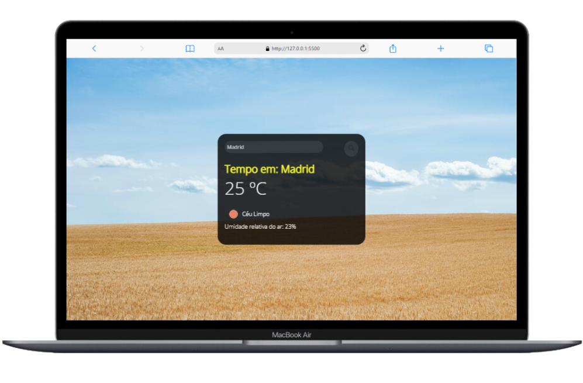

<h1> Previsão do Tempo </h1>

 Este é um projeto que fiz na Imersão DevClub, nele foi utilizado a Api da "openweathermap.org" para pegar os valores da aplicação. 

<h3> Neste projeto utilizei as seguintes tecnologias: </h3>

 
 
 
 

 

  
 
 <h3> Link do Projeto </h3>
 
 <a href="https://previsaodevclub.netlify.app/">Projeto DevClub - Previsão do Tempo</a>
 
